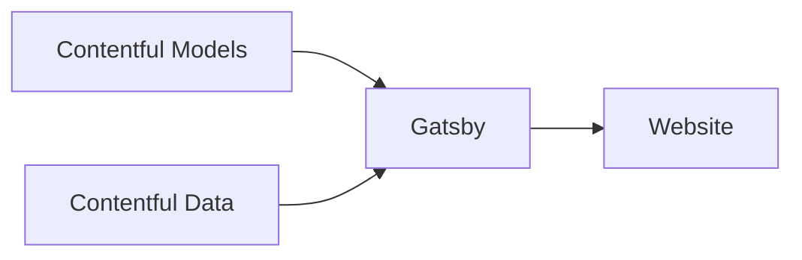

# Building a Website with Contentful

## Overview

[Contentful](https://www.contentful.com/) is a popular CMS that has many great
features:

- Intuitive UI
- GraphQL API
- Locales support
- Environment support
- Generous free tier

Combining Contentful with Gatsby is a great way to get started for a new
project.

We describe in this guide how to configure a brand new project and connect it
with a Gatsby site.

To do so, we are going to use the following tech:

- Contentful as the CMS
- the official
  [contentful-migration CLI](https://github.com/contentful/contentful-migration)
- our `core-contentful-lib` package to init our ContentTypes

## Prerequisites

This guide assume that you already have a build set up to build and deploy the
site on Github Action.

## Setup

### Project creation

### Generate Access Tokens

> PS the access token is the Content management tokens Not the (Content delivery
> / preview tokens)

### Adding WebHooks to Trigger Builds

To trigger a build and a deploy whenever content changes on Contentful, set up a
new webhooks under `Settings > Webhooks`.

Set the following values:

| Section  | Property                      | Value                                                                                                       | Optional |
| -------- | ----------------------------- | ----------------------------------------------------------------------------------------------------------- | -------- |
| Details  | Name                          | e.g. "Trigger Github Actions Build"                                                                         | No       |
| Details  | Method                        | "POST"                                                                                                      | No       |
| Details  | URL                           | `https://api.github.com/repos/<org-name>/<repo-name>/actions/workflows/vsb-website-workflow.yml/dispatches` | No       |
| Triggers | Trigger                       | ✔️ Publish, ✔️ Unpublish                                                                                    | No       |
| Triggers | Filters                       | `Environment ID equals 'master'`                                                                            | No       |
| Headers  | Header                        | `USER-AGENT=Contentful`                                                                                     | No       |
| Headers  | Header                        | `Authorization=Bearer <github-auth-token>`                                                                  | No       |
| Headers  | Header                        | `Accept=application/vnd.github.v3+json`                                                                     | No       |
| Payload  | Customize the webhook payload | `{"ref": "refs/heads/<branch-name"}`, e.g. `{"ref": "refs/heads/release"}`                                  | No       |

```
Method: POST
URL:
Trigger: ✔️ Publish	✔️ Unpublish
Filters: (default to Environment ID === 'master')
```

## Content Model

### Data

- contentful-migration
- Contentful data model
- Configuration of contentful-migration

## Content

### Markdown



### Editor Interface

https://www.contentful.com/developers/docs/concepts/editor-interfaces/

## Resources

### Courses

| Name                        | Link                                                                                     | Paid |
| --------------------------- | ---------------------------------------------------------------------------------------- | ---: |
| Bits and Bytes              | [Video](https://www.contentful.com/developers/videos/bits-and-bytes/#what-is-contentful) |   no |
| contentful-data-model       | [Doc](https://www.contentful.com/developers/docs/concepts/data-model/)                   |   no |
| contentful-migration (repo) | [Doc](https://github.com/contentful/contentful-migration)                                |   no |

### Checklist

Here is checklist that you can use in a Github issue to track all steps.

```markdown
# Contentful - Gatsby Site - Implementation

## Config

### Setup package in repo

- [ ] .gitignore
- [ ] .eslintrc
- [ ] .prettierignore
- [ ] dot-env.ts

### Create .env with contentful api key

- [ ] Space ID
- [ ] Content Delivery API - access token
- [ ] Content management tokens

### Create gatsby-config.ts

- [ ] Manifest (name, color, icon)
- [ ] Google Analytics
- [ ] Redirect pages

### Configure gatsby-node.ts

- [ ] Generation pages
- [ ] Generation blog posts or projects

### Data Modeling

- [ ] Create models
- [ ] Enter sample data

### Integration

- [ ] Template create for all the current Pages
- [ ] Context -en_CA && fr_CA
- [ ] Configure theme
- [ ] SEO: Implement JSON-LD Data on Articles, Person, etc.
- [ ] SEO: Add production site on Google Search Console
      https://search.google.com/search-console
- [ ] SEO: Update gravatar https://en.gravatar.com/emails/
- [ ] Components
- [ ] Fonts: Convert TTF or OTF Fonts to WOFF and WOFF2 with
      https://transfonter.org
- [ ] Fonts: Put files in /src/font-name-webfonts

### DevOps

- [ ] Enable webhooks to trigger build & deploy
```
