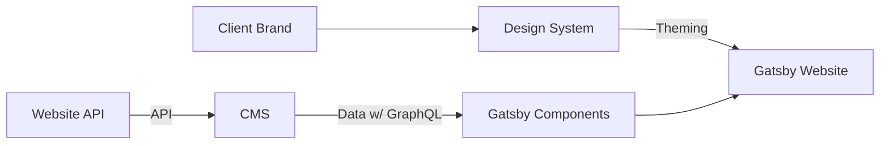
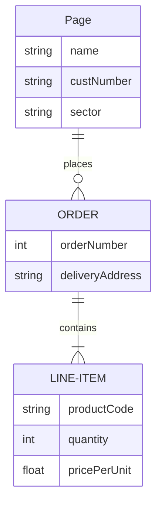

<DocHeader props={props}/>

## About

The WebsiteAPI is a collection of **data models** and matching **React
components** that allows fast creation of websites.

### Motivation

Most websites have the same essential data structure: pages, sections,
navigation (nav bar, footer, etc), blog, portfolio and so on. Re-implementing or
rethinking those for every new website is obliously tedious work.

Hence, the API offers models that should be familiar to anyone having a basic
understanding of how a website is structured.

The API is designed with **only** high level models — on purpose. The idea is
that we want to let users focus on content creation/editing (e.g. writing text
content, blog post, adding media, creating pages, reordering sections and
blocks...), leaving out any low level details (i.e. the API _does not_ give
users control over low level design aspects, those are handled by developers and
designers).

## Overview

The Website API is a collection of pure (data only) models (types and
interfaces) that can be implemented in most CMSes.

The contract is straightforward :

1. models and data are configured and set up in the CMS
1. using Gatsby, the website data is retrieved with GraphQL queries
1. pages, sections, blocks are rendered to form a complete website

Additionally, all visual aspects of the site are configured by developers and
designers in the design system config.

### API Description

| API          | Description                                                                                                           | Models                      | Optional |
| ------------ | --------------------------------------------------------------------------------------------------------------------- | --------------------------- | -------- |
| CompanyAPI   | Essential information about a business (e.g. its addresses, contact information, website, social media profiles etc.) | CompanyAddress, CompanyInfo | No       |
| PageAPI      | right-aligned                                                                                                         |                             | No       |
| BlogAPI      | right-aligned                                                                                                         |                             | No       |
| PortfolioAPI | right-aligned                                                                                                         |                             | No       |
| PortfolioAPI | right-aligned                                                                                                         |                             | No       |

## Page API

### Assets

#### Logos

| Name        | filename               | Formats    | Size    | Usage             | Link                                    |
| ----------- | ---------------------- | ---------- | ------- | ----------------- | --------------------------------------- |
| Main logo   | logo                   | .svg, .png | png     | todo              | todo                                    |
| Footer logo | logo-footer            | .svg, .png | png     | todo              | todo                                    |
| logo        | logo-symbol            | .svg, .png | png     | todo              | todo                                    |
| logo        | logo-favicon           | .svg, .png | png     | todo              | todo                                    |
| logo        | logo-youtube           | .svg, .png | png     | todo              | todo                                    |
| logo        | logo-youtube-watermark | .svg, .png | 150x150 | Youtube Watermark | <Link href={youtubeDocLink}>Docs</Link> |

export const youtubeDocLink =
'https://support.google.com/youtube/answer/2972003?co=GENIE.Platform%3DAndroid&hl=en#zippy=%2Cadd-your-video-watermark';

### Glossary

| Word | Description               | Exemple    |
| ---- | ------------------------- | ---------- |
| CMS  | Content management system | Contentful |
