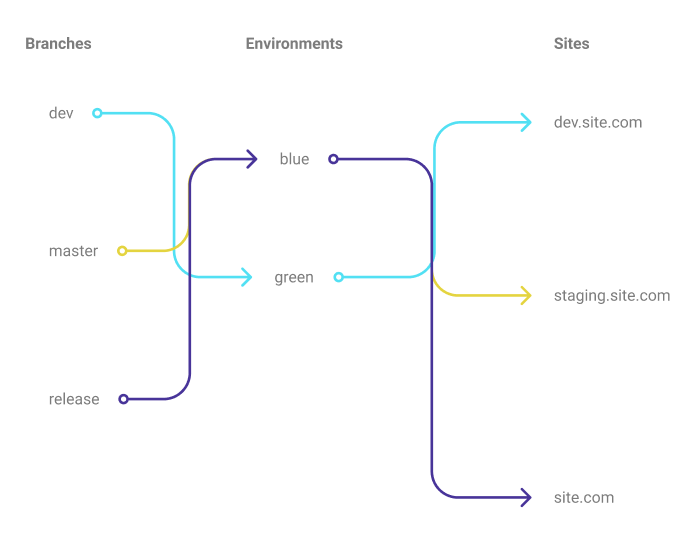

# Process to start a new project

## Contentful

- Create the organization and add a new space 
> Api keys and access tokens
- Go in the settings and select API keys.
- Create a new API key by clicking the blue button named "Add API key"
- Take note of the `content management Tokens`, the `space id` and the `Content Delivery API - access token`

> Import
- Import all the content models from the core-contentful-lib OR insert by the UI all the new content models.
- Don't forget to use the `content management Tokens` and not the `Content Delivery API - access token`
>Translation
- In the Settings' section in contentful select `locale`.
- Switch the current language for the default one in the website.
- Add a second language and make it a `fallback` to the default one.

## Contenful flow - Blue & Green
- Go in the settings and select `Environments`
- Create a new environment named `blue`.
- Change the Environment alias (`master`) target for `blue`, then delete the `master` environment as it will not be needed anymore.
- Create another environment named `green` using the `blue` environment as default.
  
> The explanation of the concept
> 
- The environment called `blue` is not to be considered as the absolute master used in the project. The concept is to switch between `blue` and `green` during deployment. 

- `blue` and `green` are only labeled as so as an exemple.


- In this diagram `blue` is considered as the master at the start of the project as it is used for all the major branches.



- In this part, the `dev` branch switches to the `green` environment while all the other branches stay on `blue`. This prevents the problems happening in the `green` environment to affect the staging and the production websites which are still linked to the `blue` environment.


- Once the `green` environment is stable and the `dev` branch has been merged into the master then we can change the master's environment to `green`.


## 1Password
- Add in a password template the  `space id` and the `Content Delivery API - access token` values.

## GitHub
> Secret keys
- Go in the setting section of the newrade repo. 
- Then go in the sub section `Secrets`
- Add the `space id` and the `Content Delivery API - access token`
- Go in the file `.github/workflows/build-only.yml` with VsCode.
- Add the `space id` and the `Content Delivery API - access token` in the current file.

exemple
```
CONTENTFUL_ACCESS_SPACEID: ${{ secrets.CONTENTFUL_ACCESS_SPACEID }}
CONTENTFUL_ACCESS_TOKEN: ${{ secrets.CONTENTFUL_ACCESS_TOKEN }}
```

## Repo set-up

- copy paster de starter and change the different value for the current website name.
- create a .env files and add the current  `space id` and `Content Delivery API - access token`

## Gatsby Cloud

- Go on the newrade organisation and "Add a Site+".

