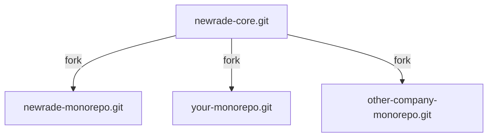

<DocHeader props={props}/>

## Overview

There are two main way to use the packages in this project.

1. **Creating your own fork:** The first one, and the one we recommend, is to
   fork the monorepo to consume its packages and then add your own packages to
   it.
2. **Consuming published packages:** The second way is by installing the
   published packages from `npm` as dependencies to your app.

While the first way requires a bit more work with `git`, we think that there are
several benefits to this approach:

- having the monorepo already set up for you means that you have all the
  scripts, tooling configuration (eslint, prettier, editorconfig, plugins,
  extensions, etc.) and workflow files to develop and build your own packages
  right away;
- by developing right in the monorepo, you have direct visibility over core
  packages that you consume in your apps;
- the monorepo contains fully working and deployed examples of a design system
  (`packages/ze-design-system`), a Gatsby website (`packages/ze-design-website`)
  and a standalone React application [COMING-SOON] (`packages/ze-app`) which you
  can use to start your own packages;
- if you want to contribute to the upstream `newrade-core` repo's code, you can
  easily request to merge changes from your fork to the main repo.
- as the upstream repository evolves, it is much easier to receive, preview, and
  tests new changes in a fork versus consuming new version of packages

## 1. Creating your own fork

While forking a project to contribute is nothing new, forking a repository to
use as a base for your own apps might be less familiar to many developers.

There are other way to boostrap a project like using a **generator** or
**project template**. The problem with these is you don't receive any updates
after you create them. The templates continue to receive updates but your
starter project begins lagging behind.

With a fork, you rely on `git` to preview and merge the changes coming from the
upstream repo.

The overal organisation look like this:



The `newrade-core` repo that we called `upstream` contains the core packages
(`packages/core-*`) and the reference Ze project (`packages/ze-design-system`,
`packages/ze-design-website` and `packages/ze-app`)

The Newrade team maintains `newrade-core` and also has its own fork for private
projects (called `newrade-monorepo` in the diagram).

The instructions below will guide you into creating a mirror copy and push it to
the repo of your choice.

### TODOs

- [ ] Complete the `fork-repo.ts` script to automate the sequence

### Prerequisites

- a Github account with your organization name `<org-name>`
- a new git repository `<repository-name>`
- to have completed the steps in the
  [developer setup](/core-docs/guides/developer-setup/) guide

### Creating the Fork

Clone the `newrade-core` repo and `cd` in the directory:

```bash
git clone --bare git@github.com:newrade/newrade-core.git newrade-core.git
cd newrade-core.git
```

Push the starter repo to your `<repository-name>`, then delete the clone if you
don't plan on commiting to the `newrade-core` repo directly:

```bash
git push --mirror git@github.com:<org-name>/<repository-name>.git
cd ..
rimraf -rf newrade-core.git
```

Checkout from your `<repository-name>` so you can work on it:

```bash
git clone git@github.com:<org-name>/<repository-name>.git <dir-name>
```

Add the `newrade-core` repo as `upstream`:

```
git remote add upstream git@github.com:newrade/newrade-core.git
```

### VSCode Workspace

Working with the workspace feature of VSCode is highly encouraged:

- It's much easier to manage settings (exlusions, navigation, debug profiles,
  etc.)
- Plugin suggestions will work right away
- Packages folders appear right on top

After cloning your fork, open the `.vscode` dir:

```bash
code <repository-name>/.vscode/
```

Make a copy of the `newrade-core.code-workspace` to `<org-name>.code-workspace`
and update the values as you wish.

For example to change the top folder name:

```diff
  "folders": [
    {
-     "name": "newrade-core",
+     "name": "<org-name>",
      "path": ".."
    },
```

Save the new file and open your workspace with:

```bash
code <repository-name>/.vscode/<org-name>.code-workspace
```

### README.md

You can update the `README.md` in the root of the repo to your liking. There
won't be any issue to upgrade — you'll preserve your current changes if the
upstream file changes.

### Done ! 🎉

At this point your fork is fully set up and you are ready to add your own
packages to it.

➡️ &nbsp; Head over to the [Monorepo Manual](/core-docs/monorepo-manual/) to
learn how to update your fork.

## 2. Consuming published packages

> While technically possible right now, we don't encourage this approach for
> now. Instruction are coming as soon as our core packages reach stability. We
> will update this page once we reach that stage.
